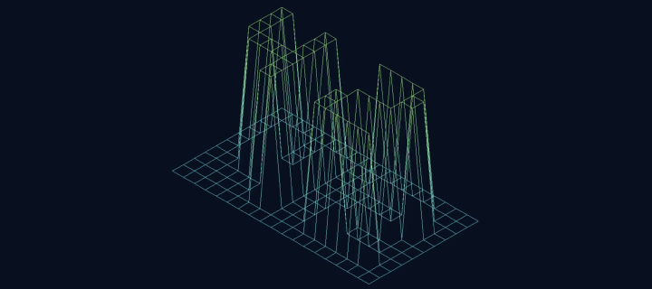
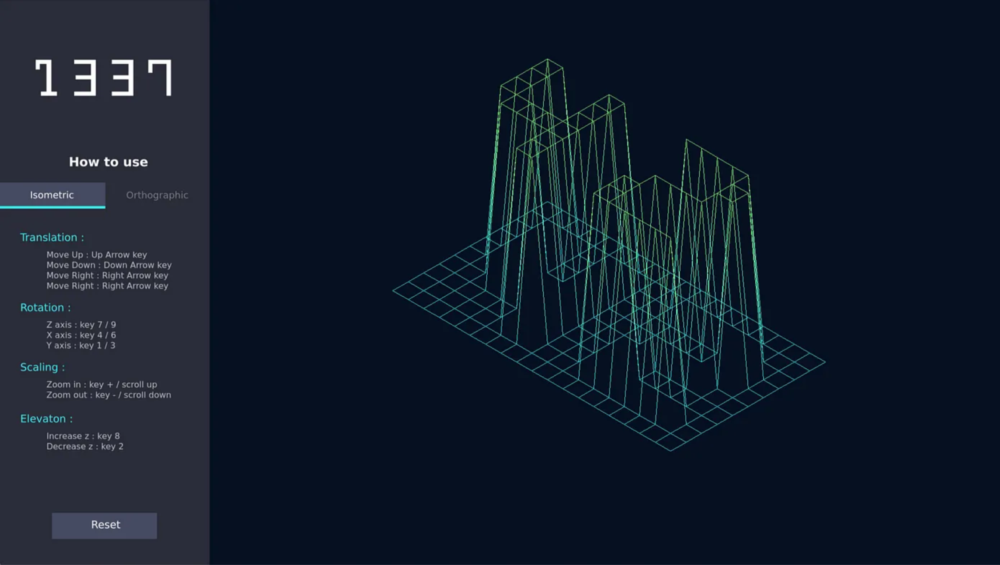
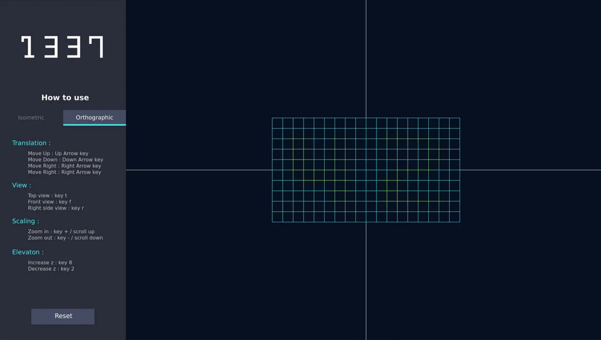

# fdf

[How I built It](https://medium.com/@alaricsaltzman913/fdf-42-a-detailed-walkthrough-7184cca317fc)

[Preview](https://youtu.be/shZQd2j4qgQ?si=XOcYigYeQ77WlCki)


## Overview

An introduction to graphics, This project is about representing a landscape as a 3D object in which all surfaces are outlined in lines using a graphics library.

## Description

-   This project is implemented in c and is compilable with a Makefile.
-   Memory leaks free, Memory leaks are not to be tolerated.
-   Error free, an error displayed in case something went wrong.
-   The program uses the 42 `minilibx` as a graphics library.
-   The management of the window remains smooth through the program lifespan.
-   Pressing ESC closes the window and quits the program in a clean way.
-   Clicking on the cross on the window’s frame also closes the window and quit the program in a clean way.
-   The program takes a map and transforms it into a 3d landscape and displays a landscape in a window using an **isometric projection**.
-   The coordinates of the landscape can be stored in a `.fdf` file passed as a parameter to the program.
-   As a bonus The program Includes the following extra features:
-   an extra projection **Orthographic**.
-   The ability to Zoom in and out, Translate and Rotate the model.
-   The program is able to transform a map like this :

```perl
0 0 0 0 0 0 0 0 0 0 0 0 0 0 0 0 0 0 0
0 0 0 0 0 0 0 0 0 0 0 0 0 0 0 0 0 0 0
0 0 10 10 0 0 10 10 0 0 0 10 10 10 10 10 0 0 0
0 0 10 10 0 0 10 10 0 0 0 0 0 0 0 10 10 0 0
0 0 10 10 0 0 10 10 0 0 0 0 0 0 0 10 10 0 0
0 0 10 10 10 10 10 10 0 0 0 0 10 10 10 10 0 0 0
0 0 0 10 10 10 10 10 0 0 0 10 10 0 0 0 0 0 0
0 0 0 0 0 0 10 10 0 0 0 10 10 0 0 0 0 0 0
0 0 0 0 0 0 10 10 0 0 0 10 10 10 10 10 10 0 0
0 0 0 0 0 0 0 0 0 0 0 0 0 0 0 0 0 0 0
0 0 0 0 0 0 0 0 0 0 0 0 0 0 0 0 0 0 0
```

Into something like this.



## User interface





[Read my explanation of the concepts and algorithms used](https://medium.com/@amehri_tarik/fdf-42-a-detailed-walkthrough-7184cca317fc)

## New Concepts

-   Pixel-Based Thinking.
-   Color Models: RGB, Hexadecimal color representation, alpha channel.
-   Rendering Loop.
-   Input Handling.
-   Graphics Libraries and APIs.
-   Working with Images and Textures.
-   Image buffering.
-   Frame Control.
-   Math for Graphics: Vector math and Trigonometry.
